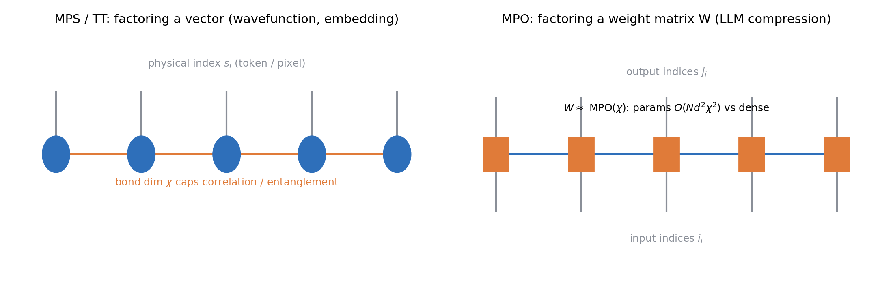
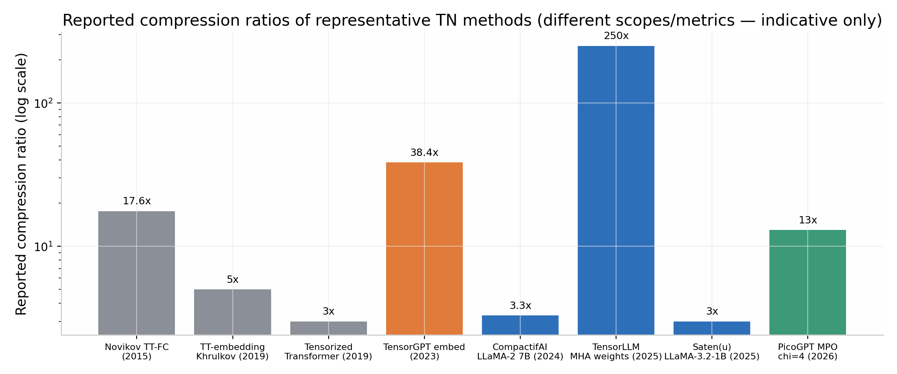
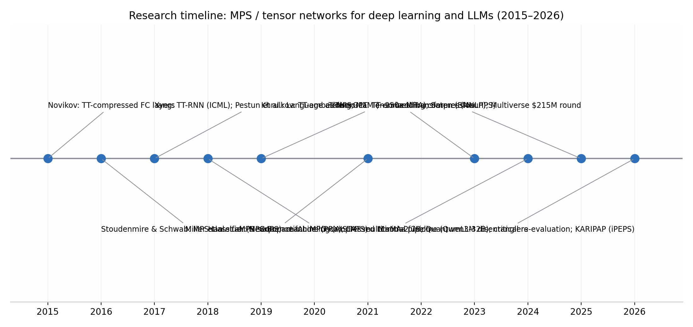

# MPS 张量网络方法用于深度学习的研究调研——面向类 LLM 与多模态大模型

## 执行摘要

矩阵乘积态（Matrix Product State, MPS）及其算符版本（MPO，数学界称张量链/Tensor Train, TT）是源于量子多体物理的一维张量网络分解方法。过去十年间，它被引入深度学习，并沿三条主线发展：（1）**MPS 作为学习模型本身**——2016 年 Stoudenmire 与 Schwab 在 NeurIPS 上用 MPS 加 DMRG 式扫描算法做监督分类，MNIST 测试错误率低于 1%（[NeurIPS](http://papers.neurips.cc/paper/6211-supervised-learning-with-tensor-networks.pdf)）；Han 等人 2018 年在 Physical Review X 上提出 MPS Born 机做无监督生成建模，被引逾 500 次（[PRX](https://link.aps.org/doi/10.1103/PhysRevX.8.031012)）；（2）**MPO/TT 用于神经网络与大模型压缩**——从 2015 年 Novikov 等人的 TT 全连接层压缩，到 2024 年 Multiverse Computing 的 CompactifAI 将 LLaMA-2 7B 压缩至原体积 30%（配合量化后内存缩减 93%、参数减少 70%，精度仅降 2–3%），成为该方向产业化程度最高的成果（[arXiv](https://arxiv.org/abs/2401.14109)）；（3）**量子/量子启发的大模型**——如用张量网络去纠缠器（disentangler）把预训练 LLM 层改写为"变分量子线路 + MPO"混合架构的工作（[arXiv](https://arxiv.org/abs/2410.17397)）。

**核心结论**：MPS/MPO 在 LLM 时代的最大现实价值是**可控、可解释的结构化权重压缩**，其"键维 χ 直接控制压缩率与关联保留量"的性质提供了区别于剪枝、量化、低秩近似的第三条路线；作为独立生成/语言模型，MPS 类模型在小规模与结构化序列任务上表现优异，但尚无证据表明其能在现代 LLM 尺度上与 Transformer 竞争；2026 年的系统性复评表明，训练后张量分解在大模型上存在由"重尾权重与高秩异常特征"导致的根本性局限（[OpenReview](https://openreview.net/pdf?id=H5NX243IUP)）。多模态方向上，张量方法（TFN/LMF 一脉）在情感分析类中等规模多模态融合中成熟，但 **MPS 类方法在多模态大模型（MLLM）中的应用基本空白**，是值得关注的开放方向。

---

## 1. 数学基础与概念框架

### 1.1 MPS/TT 与 MPO 的定义

MPS 将一个高阶张量（例如量子态振幅、联合概率或长向量）分解为一串三阶（首尾为二阶）核张量的收缩：$c_{s_1\cdots s_L}=\sum_{\{a\}}A^{s_1}_{a_1}A^{s_2}_{a_1 a_2}\cdots A^{s_L}_{a_{L-1}}$，其中相邻核之间共享的"键"（bond）的维度 χ 称为**键维**，它是整个框架的核心超参数——χ 越大，能表达的跨二分关联（物理语言：纠缠熵，$S\le\log\chi$）越强，参数量也越大（[TensorNetwork.org](https://tensornetwork.org/mps/)）。Oseledets 2011 年在 SIAM 提出的 Tensor-Train 分解与 MPS 在数学上等价，二者分别来自物理与数值线性代数社区（[arXiv](https://arxiv.org/html/2603.28534v1)）。当分解对象是**矩阵**（如神经网络的权重矩阵 $W$）时，把输入、输出指标各自拆成多个小指标后做链式分解，得到的结构称为**矩阵乘积算符（MPO）**；压缩过程通过逐次奇异值分解（TT-SVD）截断实现，参数量从指数级降为关于 χ 的多项式级（[arXiv](https://arxiv.org/abs/2401.14109)）。

MPS 具有若干对机器学习极为有用的结构性质：存在**规范形（canonical form）**使得归一化、采样、内积等操作有高效精确算法；支持 DMRG 式的局部交替优化与自适应键维截断；压缩（rounding）操作有可控误差界（[TensorNetwork.org](https://tensornetwork.org/mps/)）。这些性质使得 MPS 模型在理论上更像"白盒"——纠缠熵、量子互信息等量子信息量可以直接计算并用于解释模型学到的特征关联（[Science Partner Journal](https://spj.science.org/doi/10.34133/icomputing.0061)）。

### 1.2 为什么一维链结构适用于序列与权重

MPS 天然匹配一维关联结构（面积律）：一维有能隙量子态的纠缠满足面积律，因此可以被小 χ 的 MPS 高效表示；语言序列具有一定局部性，图像展平后近似满足，这使 MPS 成为序列数据合理的归纳偏置。对于二维或更复杂的关联结构（如高分辨率图像、全局注意力模式），一维链的表达力受限，需要树张量网络（TTN）、PEPS 或 MERA 等更高维结构——这也是后文讨论的若干局限与扩展工作的物理根源（[IOP](https://iopscience.iop.org/article/10.1088/1367-2630/ab31ef)）。

### 1.3 张量网络与深度学习交汇的整体图景

多篇综述系统梳理了这一交叉领域：Wang 等人的 "Tensor Networks Meet Neural Networks" 综述（arXiv:2302.09019）覆盖张量化的神经网络各层与 LLM 应用（[arXiv](https://arxiv.org/html/2410.17397v2)）；2026 年的综述 "Quantum-inspired tensor networks in machine learning models" 将应用分为监督学习、无监督/生成建模、模型压缩、可解释性与隐私等类别，指出 TN 的两大独特优势是**可直接计算量子信息观测量用于解释**，以及**存在保持函数不变的局部变换**（[arXiv](https://arxiv.org/html/2604.14287v1)）。GitHub 上的 awesome-tensorial-neural-networks 列表则给出了按任务和架构组织的完整文献图谱（[GitHub](https://github.com/tnbar/awesome-tensorial-neural-networks)）。

---

## 2. 主线一：MPS 作为学习模型（判别式与生成式）

### 2.1 监督学习：MPS 分类器一脉

奠基性工作是 Stoudenmire 与 Schwab（NeurIPS 2016）：将每个输入像素经局域特征映射 $\phi(x_i)$ 后做张量积，得到指数维特征空间，再用 MPS 参数化该空间中的线性分类器，以 DMRG 式双站点扫描算法训练，MNIST 上测试错误率低于 1%，且键维相当小即可（[NeurIPS](http://papers.neurips.cc/paper/6211-supervised-learning-with-tensor-networks.pdf)）。与之独立地，Novikov 等人的 **Exponential Machines** 从张量分解角度用 TT 格式隐式表示任意高阶特征交互，以随机黎曼优化训练（[arXiv](https://arxiv.org/html/2604.14287v1)）。后续 Google 的 TensorNetwork 库论文用自动微分替代 DMRG 训练 MPS，MNIST 达 98%、Fashion-MNIST 达 88%，且结果对 χ≳10 基本不敏感，GPU 相比 64 核 CPU 有约 10 倍加速（[arXiv](https://ar5iv.labs.arxiv.org/html/1906.06329)）。

这条线随后扩展到更复杂的视觉任务：基于 patch 的 MPS 医学图像分割（[MELBA](https://www.melba-journal.org/papers/2022:005.html)）、MPS/PEPS 多分类器用于 Fashion-MNIST 与新冠 X 光胸片（[ResearchGate](https://www.researchgate.net/publication/332517281_Tree_tensor_networks_for_generative_modeling)）、以及同时支持分类与生成的 MPS 模型（[Springer](https://link.springer.com/article/10.1007/s42484-025-00272-6)）。Jahromi 与 Orús 的变分张量神经网络（VTNN）将 MPO 层嵌入标准深度网络并用 PaL/DMRG 式扫描训练，MNIST 上单 epoch 达 0.958（同条件经典 NN 为 0.942），但也暴露了扫描式训练时间随张量数指数增长的问题（[PMC](https://pmc.ncbi.nlm.nih.gov/articles/PMC11329717/)）。

### 2.2 生成建模：Born 机与自回归 MPS

Han 等人（PRX 2018）提出用 MPS 的模平方表示概率分布（Born 规则），通过相邻核合并-SVD 截断的自适应训练直接建模数据分布并**无拒绝精确采样**，在 Bars-and-Stripes 与 MNIST 上验证了生成能力，该文被引 515 次，是张量网络生成模型的奠基作（[PRX](https://link.aps.org/doi/10.1103/PhysRevX.8.031012)）。Stokes 与 Terilla 提出受 DMRG 启发的无梯度确定性训练算法，在 "可被 7 整除的二进制语言" 这类结构化数据上键维 8 的 MPS 几乎完美学习，泛化 gap 仅 0.032（[PMC](https://pmc.ncbi.nlm.nih.gov/articles/PMC7514580/)）。Liu 等人（PRE 2023）将 MPS 发展为自回归无监督模型，性能可与标准传统模型竞争（[arXiv](https://arxiv.org/pdf/2303.01514)）。2025 年还有工作引入张量网络 Born 机的正则化二阶优化，改善了 NLL 训练的效率与稳定性（[arXiv](https://arxiv.org/html/2501.18691v2)），以及面向连续数据的张量网络生成模型新族（[Semantic Scholar](https://www.semanticscholar.org/paper/Unsupervised-Generative-Modeling-Using-Matrix-Han-Wang/5ed4617d39833a8dd8e931282ca2fcee136db634)）。

在模型类表达力方面，Glasser 等人（NeurIPS 2019）证明局部纯化态（LPS）等推广形式的表达力层级，Miller 等人进一步建立了 **uMPS 与预测态表示（PSR）、加权自动机（WFA）、隐量子马尔可夫模型（HQMM）之间的严格等价与包含关系**——Born 机子类等价于二次加权自动机，且存在无法被有限维 uBM 表示的 HMM，揭示了 MPS 类序列模型的表达力边界（[arXiv](https://arxiv.org/pdf/2010.10653)）。

### 2.3 序列与语言建模：u-MPS 与"语言即 MPS"

Miller、Rabusseau 与 Terilla（AISTATS 2021）的 u-MPS（各站点共享同一核的均匀 MPS）是 MPS 用于序列建模的代表作：长度 n 的序列可以 **O(log n) 深度并行求值**（区别于 RNN 的固有串行），并提出了由正则表达式定义条件分布的新型生成算法，可实现自回归采样、"填空"采样乃至无神经对应物的结构化生成；在 Tomita 文法与真实文本实验中，u-MPS 能以小数据泛化到 3 倍于训练长度且保持 90% 以上文法正确率，优于 HMM、单向 LSTM 与（小数据下的）Transformer 基线（[PMLR](https://proceedings.mlr.press/v130/miller21a.html)）。需要注意其局限：该优势主要体现在小数据、强结构场景；论文也观察到 Transformer 在小数据集上表现差这一条件性结论。

更早的理论工作直接把语言与张量网络联系起来：Pestun 与 Vlassopoulos 2017 年提出 "Tensor network language model"，Pestun 等人提出 "Language as a matrix product state"（arXiv:1711.01416），从范畴论与概率形式语言角度构造语言的 MPS 表示（[arXiv](https://www.arxiv.org/pdf/2007.03834v1)）；Gallego 与 Orús 的 "Language design as information renormalization"（SN Computer Science 2022）把语言设计视为信息重正化过程，提出用纠缠标量刻画语言复杂度的思路（[arXiv](https://arxiv.org/html/2410.17397v2)）。Guo 等人（PRE 2018）则用 MPO 做序列到序列学习（[arXiv](https://arxiv.org/pdf/2007.03834)）。这些工作构成"MPS 原生语言模型"的谱系，但都停留在中小规模验证阶段。

---

## 3. 主线二：MPO/TT 用于神经网络与 LLM 压缩（当前最活跃方向）

### 3.1 前 LLM 时代：从全连接层到 Transformer

Novikov 等人 2015 年的 "Tensorizing Neural Networks" 首次用 TT 分解压缩稠密全连接层，在保持精度的同时取得数量级参数缩减，是整个方向的源头（[arXiv](https://arxiv.org/html/2603.28534v1)）。Yang、Krompass 与 Tresp（ICML 2017）用 TT 分解 RNN 的 input-to-hidden 矩阵（TT-RNN），使参数量少几个数量级的模型在视频分类上接近 SOTA（[Vitalab](https://vitalab.github.io/article/2018/07/18/tensor-train-rnn.html)）；随后出现 MPO-LSTM、TR-LSTM（AAAI 2019）、BTT-RNN（CVPR 2018）、Conv-TT-LSTM（NeurIPS 2020）等一系列张量化循环网络（[GitHub](https://github.com/tnbar/awesome-tensorial-neural-networks/blob/main/README.md)）。Khrulkov 等人 2019 年提出 **TT-embedding**：不把训练好的嵌入矩阵事后压缩，而是直接用 TT 核参数化嵌入层并端到端训练，在情感分析、机器翻译、语言建模上大幅压缩且性能几乎无损甚至略升（[arXiv](https://arxiv.org/abs/1901.10787)）。Ma 等人（NeurIPS 2019）的**张量化 Transformer** 用块项分解（BTD）构建"多线性注意力"，在语言建模与机器翻译上以更高压缩比取得更好结果，但也报告了核数增多时的过拟合问题（[arXiv](https://arxiv.org/pdf/1906.09777)）。此外还有 ACL 2021 的 MPO 轻量化微调压缩预训练模型、EMNLP 2022 的 Hypoformer 混合 TT 压缩等（[GitHub](https://github.com/tnbar/awesome-tensorial-neural-networks/blob/main/README.md)）。

### 3.2 LLM 时代的 MPO/TT 压缩：代表方法与结果

进入 LLM 时代后，MPO/TT 压缩沿"嵌入层—注意力—FFN—整体流水线"全面铺开：

| 方法 | 年份/出处 | 张量结构 | 作用对象 | 关键结果 |
|---|---|---|---|---|
| TensorGPT（[arXiv](https://arxiv.org/abs/2307.00526)） | 2023 | TT/MPS（逐词元嵌入） | GPT-2/CerebrasGPT 嵌入层 | 嵌入层压缩 **39–65×**；3.31× 时性能反超原模型；免训练；树莓派单 token 延迟 ≤22ms |
| **CompactifAI**（[arXiv](https://arxiv.org/abs/2401.14109)） | 2024 | MPO（χ≈100）+ 修复重训 + 量化 | LLaMA-2 7B 的 SA 与 MLP 层 | 单用压缩至 **30%** 体积并恢复 >90% 精度；+量化后内存 -93%、参数 -70%、训练快 50%、推理快 25%、精度仅降 2–3% |
| TQCompressor（[dig.watch](https://dig.watch/updates/quantum-technology-company-unveils-groundbreaking-algorithm-for-compressing-large-language-models)） | 2024 | 张量网络重构连接 | GPT-2 | TQCompressedGPT-2 困惑度优于 DistilGPT-2 等压缩基线 |
| TRAWL（[arXiv](https://arxiv.org/html/2406.17261v1)） | 2024 | 堆叠权重高阶张量 + CP 分解 | RoBERTa / GPT-J 6B | 免训练免数据，WikiQA 上 RoBERTa +15.46%、GPT-J +16.26% 准确率 |
| **TensorLLM**（[arXiv](https://arxiv.org/abs/2501.15674)） | 2025 | 多头张量化 + 共享因子 Tucker | MHA 权重 | MHA 权重压缩至 **~250×**，免训练，同时提升 RoBERTa/GPT-J/LLaMA-2 的推理基准表现 |
| **Saten**（[ACL](https://aclanthology.org/2025.findings-emnlp.1287.pdf)） | EMNLP 2025 | TT + 稀疏误差项 $W\approx\hat W_{TT}+E$ | BERT-Base、LLaMA-3.2-1B | 解决预训练层高秩导致 TT 直接压缩掉精度的问题；Saten(u) 模型体积降 >3×、MAC 降 >4×；Saten(2:4) 在 CB/WSC 上反超基模型 |
| **Minima**（[AlphaXiv](https://www.alphaxiv.org/abs/2602.01613)） | 2026 | CNN 敏感度预测 + Tucker/TT/TR 混合 + 自定义内核 + 投机解码 | Qwen3-32B | 参数 32.0B→20.8B（-35%），8K 上下文峰值 VRAM 64→40 GiB；单请求吞吐 40→50→75 token/s（+投机解码）；MMLU 仅降 0.8 个百分点 |
| PicoGPT MPO 案例研究（[arXiv](https://arxiv.org/html/2603.28534v1)） | 2026 | 纯 PyTorch MPOLinear | GPT-2 式 1M 参数模型 | 每 block 压缩 5–13×；χ=16 时以 18.8% 参数保留 97.7% token 准确率；无需自定义反向传播 |
| KARIPAP（[Fugumt](https://fugumt.com/fugumt/paper_check/2510.21844v1_enmode)） | 2025 | iPEPS + TRG 收缩 | LLaMA-2 7B | 声称内存 -93%、参数 -70%、训练快 50%、推理快 25%、精度损失 2–3%；主张 2D 纠缠结构优于一维 MPS |

几个值得强调的结构性发现：其一，**层敏感度画像（layer sensitivity profiling）**——CompactifAI 发现更深层更适合张量化压缩，与"深层对 LLM 性能贡献较低"的独立观察一致；初始注意力块最敏感，每个 block 的最后一个 MLP 层比前面子层更敏感（[EmergentMind](https://www.emergentmind.com/topics/compactifai)）。其二，**修复训练（healing）不可或缺**——预训练权重通常接近满秩，朴素截断必然损伤精度，需短暂重训恢复；CompactifAI 用 1–2 个 epoch 的分布式重训使精度回升（[arXiv](https://arxiv.org/html/2410.17397v2)）。其三，**张量化与量化正交且可叠加**——CompactifAI 证明张量网络压缩（改结构）与量化（改精度）可组合，这与纯量化路线形成差异化定位（[Moonlight](https://www.themoonlight.io/en/review/compactifai-extreme-compression-of-large-language-models-using-quantum-inspired-tensor-networks)）。

### 3.3 产业化进展

Multiverse Computing（西班牙）以 CompactifAI 为核心于 2025 年 6 月完成 **2.15 亿美元 B 轮融资**，宣称可压缩开源 LLM 达 95%，推理成本节省 50–80%，压缩版 Llama 4 Scout 在 AWS 上低至每百万 token 0.10 美元（[OpenTools/TechCrunch](https://opentools.ai/news/spanish-startup-multiverse-computing-secures-dollar215m-to-revolutionize-ai-with-compactifai)）。2025 年 4 月其发布 Llama 3.1-8B 与 Llama 3.3-70B 的压缩版：体积缩减 80%、参数少 60%、能效提升 84%、推理快 40%、成本降 50%，已被银行、电信、能源企业 beta 测试（[QuantumZeitgeist](https://quantumzeitgeist.com/multiverse-computing-80-compression-of-llama-ai-models/)）。Terra Quantum 的 TQCompressor 是另一家量子公司的同类产品（[dig.watch](https://dig.watch/updates/quantum-technology-company-unveils-groundbreaking-algorithm-for-compressing-large-language-models)）。

### 3.4 批判性评估与已知局限

2026 年的系统复评 "Rethinking the Role of Tensor Decompositions in Post-Training LLM Compression" 在 GPT-J 6B、LLaMA-2 7B 及 MoE（Qwen3-30B-A3B）上统一评测 Tucker、TT 与矩阵 SVD（LASER）：结论是**张量分解假设的共享子空间与现代 LLM 学到的异质表示存在根本性错配**——权重呈重尾分布、高秩异常特征至关重要，导致免训练张量压缩在同等压缩比下显著劣于矩阵方法；TT 于 FFN 的困惑度明显高于 LASER，TensorLLM 式 Tucker 注意力分解体积缩减可忽略且不优于更简单方法（[OpenReview](https://openreview.net/pdf?id=H5NX243IUP), [AlphaXiv](https://www.alphaxiv.org/abs/2606.03465)）。其他已知局限包括：一维链结构对非局域关联表达力不足（需 PEPS/TTN）；DMRG 式训练时间与张量数呈指数增长且难以在 GPU 上匹敌 Adam（[PMC](https://pmc.ncbi.nlm.nih.gov/articles/PMC11329717/)）；张量化内核若不专门优化，参数减少不一定转化为实际吞吐（Minima 为此专门开发 Triton/CUDA 内核（[AlphaXiv](https://www.alphaxiv.org/abs/2602.01613)））。因此当前共识是：MPO/TT 压缩**必须配合敏感度分析、修复训练与硬件内核优化**才能落地，这也正是 Minima 与 CompactifAI 的工程路线。

---

## 4. 主线三：量子与量子启发的大模型

Aizpurua、Orús 等人的 "Quantum Large Language Models via Tensor Network Disentanglers"（2024，2026 更新）提出把预训练 LLM 层改写为 **VQC + MPO + VQC** 的混合量子-经典形式：先用张量网络去纠缠器把 MPO 中的纠缠尽可能转移到两个变分量子线路中，残余 MPO 可压缩到键维 1——在 SmolLM2 上，被替换层的经典参数从 110,592 降至约 36（三个数量级），困惑度上升不足 0.3%；再训练附加的酉适配器可使困惑度比原模型再降最多 1.6%，并在真实量子处理器上完成了混合推理验证（[arXiv](https://arxiv.org/abs/2410.17397)）。同一团队还有 "Quantum-enhanced LLMs on quantum hardware via Cayley unitary adapters" 等后续工作（[arXiv](https://arxiv.org/html/2410.17397v2)）。

更广义的量子 NLP 路线（DisCoCat 范畴语法、量子嵌入等）也有探索：例如用密度矩阵建模图文双模态关联的量子启发情感分析框架（[MDPI](https://www.mdpi.com/2079-9292/12/16/3504)）、在量子计算机上用酉张量树做新闻标题与影评分类（[LMU thesis](https://bib.nm.ifi.lmu.de/pdf/muel24.pdf)）。这些工作目前均为概念验证规模，其意义在于为"量子硬件承载语言模型子模块"探索路径，而非近期可替代经典 LLM。

---

## 5. 多模态方向：现状与空白

### 5.1 张量方法在多模态融合中的成熟支脉（非 MPS 主线）

多模态情感分析中的 **Tensor Fusion Network（TFN, Zadeh 等 2017）** 通过对各模态表示做外积显式建模单模态、双模态、三模态交互，在 CMU-MOSI 上二分类准确率 77.1%、五分类 42.0%，但当时 SOTA 提升显著（[EmergentMind](https://www.emergentmind.com/articles/1707.07250)）；其代价是维度指数爆炸。**Low-rank Multimodal Fusion（LMF, Liu 等 2018）** 对融合权重张量做低秩分解（CP 型），复杂度从指数降为关于模态数线性，在情感分析、说话人特质、情绪识别三任务上保持竞争力且训练推理大幅加速（[ACL](https://aclanthology.org/P18-1209.pdf)）。这一支脉本质是 CP/低秩张量分解，而非 MPS，但证明了"张量结构 + 低秩"对跨模态交互建模的有效性。

### 5.2 MPS 在视觉与多模态大模型中的渗透

视觉侧：MPS/TT 已用于图像分类（MNIST/Fashion-MNIST/医学影像分割，见 §2.1）、高光谱-多光谱图像融合（[arXiv](https://arxiv.org/html/2604.14287v1)）；Vadlamannati 与 Solgi 的 **Partial Tensorized Transformers** 同时对 **BERT 与 ViT** 做嵌入层压缩与部分张量化（PTNN），报告在无后训练调整下精度提升最高 5%（[LIMS](https://axi.lims.ac.uk/paper/2310.20077)）。这些结果说明 TT/MPS 对 ViT 类视觉骨干同样适用——而 ViT 正是 LLaVA 等 MLLM 的视觉编码器。

**直接的 MPS×MLLM 工作目前基本缺失**：主流 MLLM 的效率优化走的是视觉 token 压缩/剪枝路线（如对 LLaVA 视觉上下文的分阶段压缩（[arXiv](https://arxiv.org/html/2406.20092v1)）），而非张量网络。KV 缓存侧有 Tensor Product Attention（TPA）将 Q/K/V 分解为低秩上下文物以压缩 KV 缓存一个数量级、且与 RoPE 兼容（[PyImageSearch](https://pyimagesearch.com/2025/12/01/kv-cache-optimization-via-tensor-product-attention/)），但这是张量分解而非 MPS 链式结构。因此，"用 MPO 压缩 MLLM 的视觉编码器与跨模态投影器""用 MPS 表示多模态 token 序列"属于明确的**研究空白与机会点**。

---

## 6. 独特优势：可解释性、隐私与算法特性

MPS 模型相对常规神经网络有几项差异化能力。**可解释性**：TN 可被解释为显式量子态，纠缠熵与量子互信息给出特征复杂度与关联的内在度量，已被用于可解释 NLP 与网络安全场景（[arXiv](https://arxiv.org/html/2604.14287v1)）；CompactifAI 的键谱/层敏感度分析本身就是"相关性空间"视角的可解释压缩（[EmergentMind](https://www.emergentmind.com/topics/compactifai)）。**隐私**：MPS 的结构化参数化被用于增强隐私的学习协议（Pozas-Kerstjens 等 2024）（[arXiv](https://arxiv.org/html/2604.14287v1)）。**算法特性**：u-MPS 序列求值可 O(log n) 深度并行（[PMLR](https://proceedings.mlr.press/v130/miller21a.html)）；DMRG 式局部优化可在小 χ 下自适应确定最小参数量，训练成本随样本数至多线性增长（[NeurIPS](http://papers.neurips.cc/paper/6211-supervised-learning-with-tensor-networks.pdf)）；MPS 生成模型支持精确无拒绝采样与正则表达式约束采样，这在神经生成模型中没有直接对应物（[PMLR](https://proceedings.mlr.press/v130/miller21a/miller21a.pdf)）。

---

## 7. 综合对比与研究机会

### 7.1 三类范式对比

| 维度 | MPS 作为模型 | MPO/TT 压缩 LLM | 量子混合 LLM |
|---|---|---|---|
| 代表工作 | MPS 分类器、Born 机、u-MPS | CompactifAI、Saten、Minima、TensorGPT | TN 去纠缠器 VQC+MPO |
| 成熟度 | 学术验证充分，规模有限 | **已有商业化产品**（Multiverse $215M B 轮） | 概念验证（SmolLM2 单层） |
| 规模证据 | MNIST/小文本/Tomita 文法 | 最大至 Qwen3-32B、LLaMA-70B | 单层替换 + 真实量子芯片推理 |
| 主要瓶颈 | 1D 结构表达力、训练效率 | 重尾权重、需 healing 与内核工程 | 量子硬件规模与噪声 |
| 独特卖点 | 精确采样、可解释、并行求值 | χ 可控、与量化正交、层敏感度画像 | 参数量级压缩、量子增强上限 |

### 7.2 开放问题与机会点

1. **MPS×MLLM 空白**：将 MPO 压缩系统性应用于多模态大模型（视觉编码器、投影器、跨模态注意力），或把 MPS 作为多模态序列的原生表示，目前几乎无人占据。
2. **超越一维链**：KARIPAP 的 iPEPS+TRG 方向（声称捕捉注意力中的多方向纠缠）提示 2D 结构可能比 MPO 更匹配 Transformer 权重几何，但需要独立复现验证（[Fugumt](https://fugumt.com/fugumt/paper_check/2510.21844v1_enmode)）。
3. **修复训练与敏感度预测的自动化**：Minima 的 CNN 敏感度预测器路线表明"在哪里压、用什么结构压"可以学习化，是工程落地的关键（[AlphaXiv](https://www.alphaxiv.org/abs/2602.01613)）。
4. **训练态（training-time）张量化**：多数成功案例如 TT-embedding、张量化 Transformer 是"从头张量化训练"而非事后压缩；在 LLM 预训练中以 MPO 原生参数化并结合 scaling law 研究，是未被充分探索的方向。
5. **与既有压缩栈的协同**：张量压缩与量化、剪枝、投机解码正交叠加已被验证（CompactifAI+量化、Minima+投机解码），统一的高效栈是实用化方向。

## 8. 结论

MPS 张量网络为深度学习提供了一套兼具**结构先验、可控近似与物理可解释性**的数学工具。对大模型而言，其最现实的价值已被 CompactifAI、Saten、Minima 等工作证实：在关联空间而非神经元计数上做压缩，配合敏感度画像、修复训练与定制内核，可在 7B–32B 尺度上取得体积减半乃至更激进的压缩而精度损失控制在 1–3 个百分点，并已产生数亿美元级的商业转化。与此同时，2026 年的批判性复评提醒我们：免训练张量分解并非免费午餐，现代 LLM 权重的重尾与高秩异常特征构成根本性障碍，张量方法的合理定位是**混合压缩工具箱中的结构化组件**而非银弹。对研究者而言，多模态大模型的张量化、高维张量网络结构（TTN/PEPS/MERA）对注意力的适配、训练态原生张量化 scaling 行为，以及 MPS 生成模型的约束采样能力在可控生成中的利用，是未来 2–3 年最值得投入的方向。

---

## 9. 经典教程网站、权威专著与前沿知识库导引（截至2026）

为便于理论推导、算法复现与大模型工程实操，本节系统整理国际物理学界与计算科学界公认的顶级教程网站、权威综述、经典专著与开源知识库生态（同步收录于 Web 交互界面的 [工具与知识库页](app/toolboxes.html#portals)）。

### 9.1 核心交互式学习平台与教程网站

| 平台 / 网站 | 核心定位与特色 | 配套语言 / 工具 | 资源链接 |
| :--- | :--- | :--- | :--- |
| **Tensors.net** | 由 Glen Evenbly 维护。被学界公认为最经典、最直观的手把手实操教程，从零推导并实现 MPS、DMRG、TEBD、TRG、CTMRG、MERA 及 2D PEPS，包含丰富交互图解。 | Python (NumPy) / MATLAB / Julia | [tensors.net](https://www.tensors.net) |
| **TensorNetwork.org** | 张量网络理论、算法与软件的社区综合枢纽（Miles Stoudenmire、Glen Evenbly、Frank Pollmann 等联合发起）。规范化 Penrose 图解记号（Graphical Notation），涵盖各类拟态数学定义与社区资源库。 | 概念图解 / 算法规范 / 综述索引 | [tensornetwork.org](https://tensornetwork.org) |
| **TensorTutorials (UGent)** | 比利时根特大学量子物理组（Frank Verstraete、Jutho Haegeman 等，MPS/PEPS/VUMPS 算法源头）。深入讲解热力学极限基态算法（VUMPS）、切空间方法（Tangent Space）与 2D PEPS 模拟。 | Julia (TensorKit.jl / MPSKit.jl) | [tensor-networks.github.io](https://tensor-networks.github.io) |
| **PennyLane Demos & TN** | Xanadu 维护的交互式开源教程库。系统讲解张量网络与量子线路（Quantum Circuits）的对偶映射、量子机器学习（QML）中 MPO/MPS 参数化及图张量网络收缩。 | Python (PennyLane / PyTorch / JAX) | [pennylane.ai/qml/demonstrations](https://pennylane.ai/qml/demonstrations/) |
| **ITensor Docs & Tutorials** | Flatiron 研究所维护的现代顶级多体计算库官方文档。兼具严格的代数图解教程与现代高性能编程范式，原生覆盖 Abelian / 非 Abelian 量子数守恒与高效自适应 Lanczos DMRG。 | Julia (ITensors.jl) / C++ | [itensor.github.io](https://itensor.github.io/ITensors.jl/stable/) |

### 9.2 权威理论与方法综述

1. **Cirac, Pérez-García, Schuch, Verstraete (Rev. Mod. Phys. 2021)**
   - *Matrix product states and projected entangled pair states: Concepts, symmetries, theorems* ([arXiv:2011.12127](https://arxiv.org/abs/2011.12127))
   - **学术定位**：张量网络理论奠基团队联合撰写的 80+ 页公理化现代“圣经”。严格证明了 MPS 与 PEPS 的基本定理、规范形存在性、对称性分类（整体与规范局域对称性）以及拓扑序（Topological Order）表征，是理解张量态数学本质的必读文献。
2. **Román Orús (Nature Reviews Physics 2019)**
   - *Tensor networks for complex quantum systems* ([arXiv:1812.04011](https://arxiv.org/abs/1812.04011))
   - **学术定位**：高引用全景导引。图文并茂地串联起 1D (MPS)、2D (PEPS)、临界标度 (MERA)、耗散开放体系以及张量网络在机器学习（TN in ML）与全息量子引力（AdS/CFT）中的早期渗透。
3. **Shi-Ju Ran (冉仕举) 等 (Springer LNP 2020)**
   - *Tensor Network Contractions: Methods and Applications to Quantum Many-Body Systems* ([arXiv:1708.09213](https://arxiv.org/abs/1708.09213))
   - **学术定位**：专注“如何把网络变成高效数值收缩算法”。详述正交规范化、实空间 RG、粗粒化与 CTMRG 等数值算法的工程落地，对动手写代码极为实用。
4. **Tarasov, Ahmadi-Asl, de Almeida, Cichocki (arXiv:2608.30505, 2026)**
   - *Tensor Methods for Language Models: From Token Representation to Training, Adaptation, Compression, Inference, and Interpretability* ([arXiv:2608.30505](https://arxiv.org/abs/2608.30505))
   - **学术定位**：截至 2026 年最新、最系统总结“张量方法用于语言大模型”的权威综述，涵盖 Token 嵌入、注意力与 FFN 的矩阵乘积算符重写、TeRA 等高秩适配、全生命周期压缩与量子信息可解释性。
5. **Valverde et al. (arXiv:2604.14287, 2026)**
   - *Quantum-inspired tensor networks in machine learning models* ([arXiv:2604.14287](https://arxiv.org/abs/2604.14287))
   - **学术定位**：2026 年量子启发张量网络机器学习全景。涵盖监督学习、Born 机无监督生成、模型压缩，重点阐明了利用纠缠熵/量子互信息实现可解释性与隐私保护的数学优势。
6. **Wang, Pan, Xu, Li, Yang, Mandic, Cichocki (arXiv:2302.09019, 2023/2026)**
   - *Tensor Networks Meet Neural Networks: A Survey and Future Perspectives* ([arXiv:2302.09019](https://arxiv.org/abs/2302.09019))
   - **学术定位**：系统梳理张量化神经网络各层设计（Conv、RNN、Transformer、LLM）以及软硬件协同加速方案的代表性综述。

### 9.3 经典专著与现代高阶讲义

1. **冉仕举、乐伟、彭程 等《张量网络态方法与应用》（科学出版社，2020）**
   - **特点**：国内第一部系统讲解张量网络态的中文权威专著。从 SVD/MPS 入门，逐步进阶到 PEPS、MERA、热态张量网络，并配有详细 Python 算法实现思路与例程，中文学习首选。
2. **Jacob Biamonte《Tensor Networks in a Nutshell》（2020 / arXiv:1912.10049）**
   - **特点**：以 Penrose 简明图形语法为核心，串联起量子线路、张量收缩复杂性与凝聚态模型，风格生动精炼。
3. **Les Houches Lecture Notes on Tensor Networks (2025/2026 / arXiv:2512.24390)**
   - **特点**：法国莱苏什理论物理暑期学校最新高阶讲义集。汇集国际一流学者讲授的现代高阶数值技巧（纠缠哈密顿量、连续张量网络与拓扑相）。
4. **Tensor Cookbook: Mastering Tensors through Diagrams (2026 / arXiv:2605.16610)**
   - **特点**：2026 年最新发布的图解实战手册，专注于脱离繁杂指标下标记号的图解代数推导，提供大量工业界与学术界常见的复杂网络收缩优化模板。

### 9.4 核心开源工具生态快速查阅

针对大模型与高维张量网络收缩，结合本项目的工具库，形成以下技术栈建议：
- **任意图网络收缩与线路模拟**：`quimb` + `cotengra`（支持超图划分、搜索近最优收缩路径，支撑谷歌悬铃木模拟）。
- **物理模拟与凝聚态前沿**：`ITensors.jl`（Julia，多重对称性守恒与极速 Lanczos DMRG）与 `TeNPy`（Python，成熟的 1D/2D 多体算法）。
- **通用张量代数与机器学习**：`TensorLy`（支持 PyTorch/JAX 后端，专注 CP/Tucker/TT 分解）。

